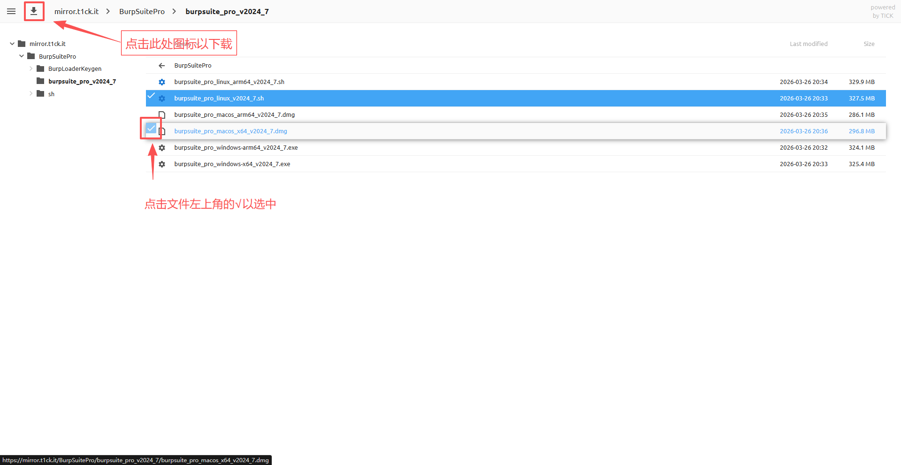

> ## ⚠️ 未授权工具免责声明 / Disclaimer for Unauthorized Tool
> 
> 本工具仅供 **学习和研究用途**，未经相关权利方授权，不得用于任何商业、非法或侵权行为。使用本工具可能涉及风险，包括账号封禁、法律责任或其他不可预见的后果。作者对因使用本工具而产生的 **任何直接或间接损失** 不承担责任。请用户在使用前充分了解相关法律法规并自行承担风险。
>   
> This tool is provided **for educational and research purposes only**. It is **unauthorized** and must not be used for any commercial, illegal, or infringing activities. Use of this tool may involve risks, including account suspension, legal liability, or other unforeseen consequences. The author **assumes no responsibility for any direct or indirect losses** arising from its use. Users should fully understand relevant laws and regulations and assume all risks before using.

---
> ❕ 本仓库使用的文件均存储于 [**TICK MIRROR**](https://mirror.t1ck.it/)  

#### 快速入门 TICK MIRROR

<p align="center">
  
</p>
<p align="center"><em>如何使用 TICK MIRROR</em></p>

## 如何使用？

- 下载本仓库提供的虚拟机，导入VMware直接使用
   > ❕本仓库已完成下述所有操作，并上传于 [**TICK MIRROR**](https://mirror.t1ck.it/) ，下载可开包即用。  
   > 下载请参阅：[TICK MIRROR | CentOS_network-autooperathon](https://mirror.t1ck.it/CentOS_network-autooperathon/)  
- 或 根据下述步骤完成对虚拟机的*完善*
  
#### 本仓库提供的虚拟机集成了：
   - Python 3.6.15
   - Python 3.11.15
   - Python 3.12.13
   - Graphviz

## CentOS7 编译 Python + OpenSSL 操作手册

### 一、环境准备

安装编译工具：

```bash
yum groupinstall "Development Tools" -y
```

安装 Python 编译依赖：

```bash
yum install -y \
wget \
gcc \
make \
zlib-devel \
bzip2-devel \
libffi-devel \
readline-devel \
sqlite-devel \
xz-devel \
tk-devel
```

创建源码目录：

```bash
mkdir -p /usr/local/src
cd /usr/local/src
```

---

### 二、编译 OpenSSL

CentOS7 自带 OpenSSL 版本较旧，编译 Python 时建议使用 **OpenSSL 1.1.1**。

下载源码：

```bash
wget https://www.openssl.org/source/openssl-1.1.1w.tar.gz
```

解压：

```bash
tar -xzf openssl-1.1.1w.tar.gz
cd openssl-1.1.1w
```

配置编译：

```bash
./config \
--prefix=/usr/local/openssl \
--openssldir=/usr/local/openssl
```

编译：

```bash
make -j$(nproc)
```

安装：

```bash
make install
```

配置动态库路径：

```bash
echo "/usr/local/openssl/lib" >> /etc/ld.so.conf
ldconfig
```

验证 OpenSSL：

```bash
/usr/local/openssl/bin/openssl version
```

示例输出：

```
OpenSSL 1.1.1w
```

---

### 三、编译 Python

下载 Python 源码：

```bash
cd /usr/local/src

wget https://www.python.org/ftp/python/3.11.8/Python-3.11.8.tgz
```

解压：

```bash
tar -xzf Python-3.11.8.tgz
cd Python-3.11.8
```

配置编译参数：

```bash
./configure \
--prefix=/usr/local/python3 \
--with-openssl=/usr/local/openssl \
--enable-optimizations
```

说明：

| 参数                       | 作用             |
| ------------------------ | -------------- |
| `--prefix`               | 指定 Python 安装路径 |
| `--with-openssl`         | 指定 OpenSSL 位置  |
| `--enable-optimizations` | 启用性能优化         |

开始编译：

```bash
make -j$(nproc)
```

安装：

```bash
make altinstall
```

注意：

```
不要使用 make install
```

否则可能覆盖系统自带 Python。


---

### 四、验证 SSL 模块

测试 Python SSL：

```bash
python3 -c "import ssl; print(ssl.OPENSSL_VERSION)"
```

示例输出：

```
OpenSSL 1.1.1w
```

如果显示 OpenSSL 版本说明 **SSL 模块编译成功**。

---

### 五、测试 pip

升级 pip：

```bash
pip3 install --upgrade pip
```

测试安装：

```bash
pip3 install requests
```

如果能正常下载，说明 HTTPS 工作正常。

---
